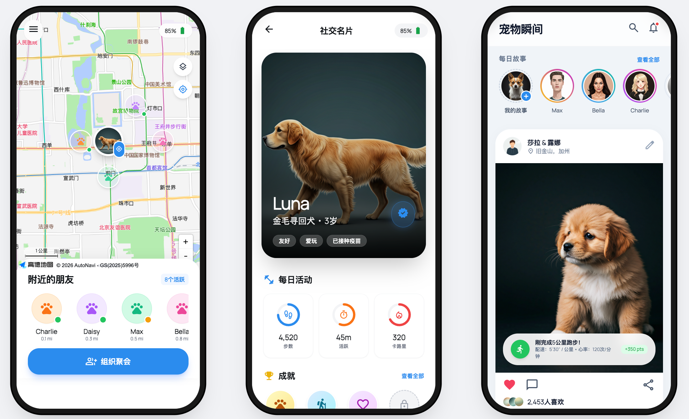

# 宠影孪生 PetFusion

<div align="center">

**宠物数字孪生与情感智能科技**

基于多传感器智能服装的宠物全生命周期健康管理平台

[]()
[]()</div>

</div>

---

## 📖 项目介绍

**宠影孪生 (PetFusion)** 是一个基于多维生命体征数据的宠物数字孪生与情感智能科技项目。通过自研的宠物智能服装，实时监控宠物的心率、血氧、体温、运动姿态等生理指标，利用 AI 进行大数据分析，实现宠物健康风险的早期精准预警。  

### 核心理念

- **健康监测**: 基于多传感器的自研宠物智能服装，实时监控宠物的运动时间、运动姿态、睡眠时间、运动量、心率、血氧等生理指标
- **疾病预警**: 通过姿态识别功能，在宠物下泌尿道疾病、关节炎、外耳道炎等疾病的早期发现与预防中起到重要作用
- **数字孪生**: 持续采集音频、动捕、生理数据并数字化存储，在宠物去世后，在数字孪生层面"复生"宠物，延续情感陪伴

### 关键词

`数字孪生` `具身智能` `多传感器方案` `宠物健康管理` `姿态识别`

---

<div align="center">
  
</div>

## 🎯 核心功能

### 1️⃣ 智能服装实时监控

**全维感知体系**

- 📊 **生理指标**: 心率、血氧、体温等实时监测
- 🏃 **行为姿态**: 精准识别行走、奔跑、跳跃、睡眠等数十种行为
- 🌡️ **环境感知**: 同步感知环境温湿度变化

**AI 深度分析**

- 多传感器融合算法提升判断准确性
- 基于云端宠物健康大模型挖掘数据价值
- 每日/每周自动生成个性化健康报告

**智能预警系统**

- 实时数据看板直观可视
- 完整健康历史档案记录
- 异常情况多渠道即时预警
- 在线宠物医院咨询对接

### 2️⃣ 姿态检测 - 读懂宠物的"无声语言"

通过高精度姿态识别技术，捕捉细微的行为变化，实现早期疾病预警：


| 监测类型          | 识别能力                             | 健康价值         |
| ------------------- | -------------------------------------- | ------------------ |
| 🦴 关节炎风险     | 精准识别轻微跛行、步态僵硬、起身困难 | 早期骨骼健康预警 |
| 💧 下泌尿道监测   | 监测频繁进出砂盆、异常蹲姿           | 及时发现排尿不适 |
| 👂 耳部不适检测   | 识别频繁抓挠耳朵、甩头动作           | 提示耳道炎症风险 |
| 😣 疼痛与应激评估 | 分析睡眠姿态、活动量骤变             | 综合评估身心压力 |

### 3️⃣ 宠物数字孪生

**技术实现路径**

1. **数据采集**: 智能服装采集多模态数据
2. **数据建模**: AI 转化为健康与行为指标
3. **模型构建**: 云端创建唯一动态数字身份
4. **模拟与预测**: 干预模拟与健康趋势预判

**核心价值**

- 📋 全生命周期健康档案
- 🎯 个性化精准服务推荐
- 🔬 科研数据与育种支持
- 📊 宠物保险精算依据

### 4️⃣ 数字化复生 - 让爱超越时空

在宠物离世后，基于其数字孪生档案，利用 AI 生成技术创造一个能够与主人互动的 AI 虚拟形象：

- **声音模仿**: 采集宠物叫声与互动模式
- **行为复刻**: 利用大模型训练模仿宠物性格的 AI 模型
- **实时交互**: 通过 App 实现对话与互动

> 让爱与回忆，在数字世界中永恒延续

### 5️⃣ 宠友圈社交

- 🐕 专属养宠人的轻社交圈子
- 📸 分享宠物日常点滴与成长趣事
- 🆔 一键生成专属宠物数字名片

---

## 🏗️ 技术架构

```
┌─────────────────────────────────────────────────────┐
│                  应用层 (交互终端)                    │
│        用户端 App | Web 管理后台 | 第三方 API            │
└─────────────────────────────────────────────────────┘
                          ↑
┌─────────────────────────────────────────────────────┐
│              云端平台 (智能分析层)                     │
│   云原生存储 | 宠物健康大模型 | 数字孪生引擎           │
└─────────────────────────────────────────────────────┘
                          ↑
┌─────────────────────────────────────────────────────┐
│              数据传输层 (IoT Gateway)                 │
│         低功耗蓝牙 (BLE) | NB-IoT/eSIM 双模通信         │
└─────────────────────────────────────────────────────┘
                          ↑
┌─────────────────────────────────────────────────────┐
│               传感器层 (感知层)                       │
│   六轴 IMU | PPG 心率血氧传感器 | 环境温度传感器         │
│            自研柔性智能服装集成                      │
└─────────────────────────────────────────────────────┘
```

---

## ✨ 产品优势


| 维度         | 传统产品               | 宠影孪生 PetFusion               |
| -------------- | ------------------------ | ---------------------------------- |
| **监测维度** | 单一维度监测，数据片面 | 多模态融合 (生理 + 行为 + 环境)  |
| **佩戴形态** | 硬质项圈，佩戴不适     | 柔性智能服装，无感舒适           |
| **核心算法** | 通用模型，套用人类标准 | 百万级宠物数据训练的专属 AI 模型 |
| **功能定位** | 基础体征记录 + GPS     | 风险主动预警 + 行为深度解读      |
| **数据价值** | 数据孤岛，价值未挖掘   | 数字孪生，打通全服务生态         |

---

## 📱 产品体验

### 小程序体验

扫描下方小程序码，立即体验宠影孪生功能：

<div align="center">


**微信扫码 · 开启智能养宠新体验**

</div>

### APP 截图预览

<div align="center">




</div>

---

## 📊 市场前景

### 宠物经济蓝海市场

- **全球市场规模**: 2023 年 2,610 亿美元 → 2030 年 3,850 亿美元 (CAGR: 5.5%)
- **中国市场规模**: 2025 年 3,126 亿元 → 2030 年 7,000 亿元 (CAGR: 14.8%)
- **市场渗透率**: 中国养宠家庭渗透率约 22%，远低于美国 65%，增长空间广阔

### 消费趋势升级

宠物消费正从"吃、穿"向"医、养、娱"等高附加值领域转移：

- 🍖 宠物食品 (53.7%) - 高端化、功能化
- 🏥 宠物医疗 (27.6%) - 预防医疗与慢病管理激增
- 🛍️ 宠物用品 (12.2%) - 智能用品增长最快赛道
- 🎾 宠物服务 (6.5%) - 个性化定制服务潜力巨大

---

## 👥 核心团队

### 创始团队


| 成员       | 专业背景                           | 职责分工                          |
| ------------ | ------------------------------------ | ----------------------------------- |
| **杨建飞** | 日本东京大学 量子人工智能博士      | 算法工程师 - 多传感器数字孪生算法 |
| **陈拓亮** | 深圳知名激光打印公司资深硬件工程师 | 硬件工程师 - 宠物专项传感器设计   |
| **张夏千** | 中国美术学院 工业设计专业          | 产品设计官 - APP 界面与服装设计   |
| **刘曦伦** | 四川农业大学 动物医学专业          | 动物医学工程 - 宠物姿态与健康研究 |
| **黄奕珩** | 日本东京大学 量子人工智能博士      | 算法工程师 - 自适应传感器算法     |

### 招募方向

我们正在寻找更多优秀的伙伴加入：

- 🎨 **工业设计方向**: 负责电池仓模型、传感器外壳、PCB 板设计
- 🖼️ **美术建模方向**: 负责宠物建模、渲染、绑骨、动画 (熟悉 Blender)
- 👕 **服装设计方向**: 负责宠物智能服装设计 (熟悉 MD 等服装建模软件)

---

## 🚀 发展计划

### 短期规划 (1-3 个月)

- 聚焦核心功能原型验证
- 完成团队磨合与基础架构搭建
- 确立 MVP 产品交付标准

### 中期规划 (3-12 个月)

- 拓展核心用户市场，实现月活持续增长
- 完成 3 个关键功能迭代
- 建立初步品牌认知度

### 长期规划 (1 年以上)

- 构建宠物健康全生态闭环
- 成为行业标杆企业
- 打造线上线下一体化的"宠伴星云"元宇宙

---

## 💼 商业模式

### 多元化盈利体系

1. **硬件销售**: 智能穿戴服装一次性销售收入
2. **订阅服务**: 深度健康报告、AI 预警、在线问诊年费
3. **数据服务**: 向医院、保险、科研机构提供数据分析
4. **生态合作**: 开放生态推荐佣金分成

### 融资规划

- **种子轮**: 核心产品原型开发、小规模用户测试
- **天使轮**: 产线建设、团队扩充、市场扩张
- **A 轮及以后**: 全生态系统构建、海外拓展、前沿技术研发

---

## 📁 项目结构

```
开源仓库/
├── README.md                 # 项目说明文档
├── static/                   # 静态资源目录
│   ├── 小程序码.png          # 微信小程序二维码
│   ├── APP 截图 -1.png        # 应用界面截图 1
│   ├── APP 截图 -2.png        # 应用界面截图 2
│   ├── 宠影孪生.pdf          # 项目介绍 PDF
│   └── 国美大创招募.docx     # 招募文档
└── ...
```

---

## 🤝 参与贡献

我们欢迎各种形式的贡献：

- 🐛 报告 Bug 或提出功能建议
- 💡 分享你的使用体验和改进想法
- 📝 帮助完善文档
- 🔧 提交代码优化

---

## 📄 开源协议

本项目采用 MIT 开源协议

---

## 📞 联系我们

- 📧 Email: [项目联系邮箱]
- 💬 微信公众号：宠影孪生
- 🌐 官方网站：[项目官网]

---

<div align="center">

**让爱超越时空** 🐾

*宠伴星云 · 科技守护爱*

</div>
